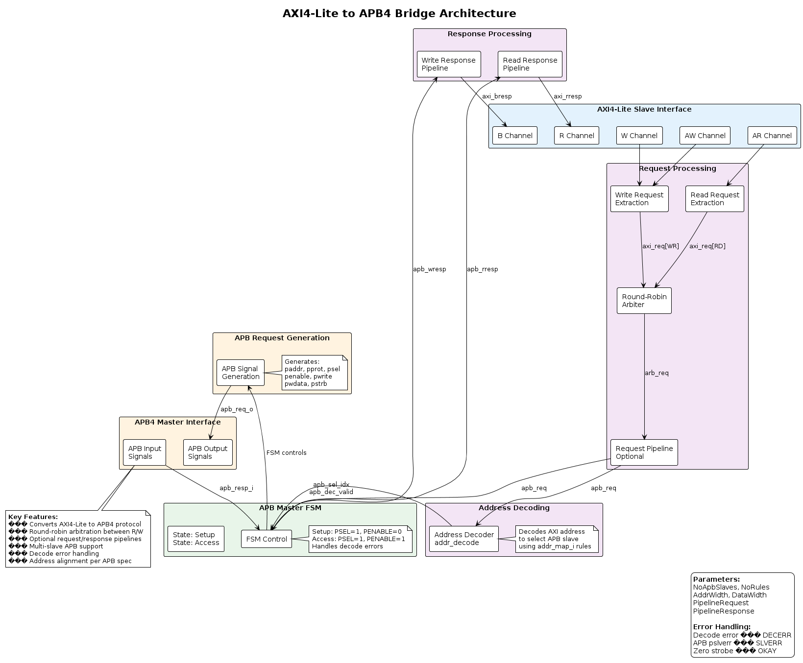
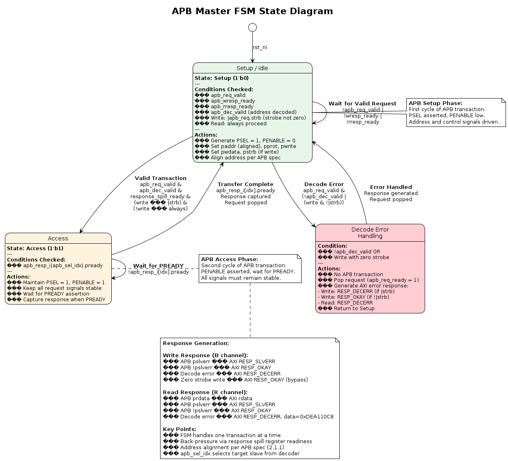
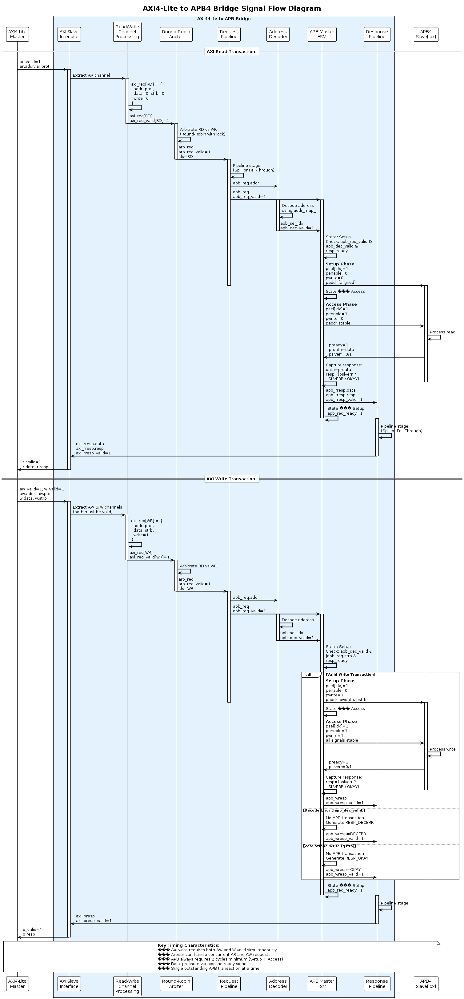
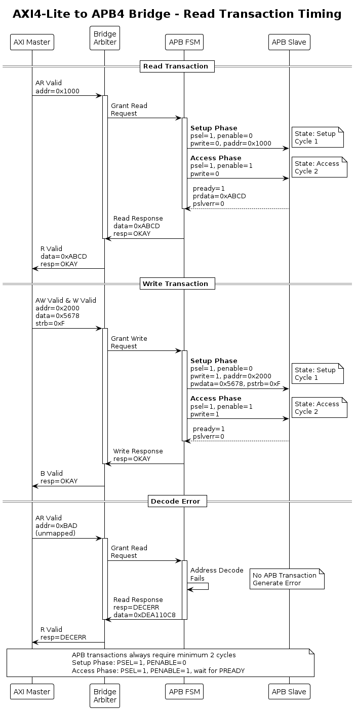
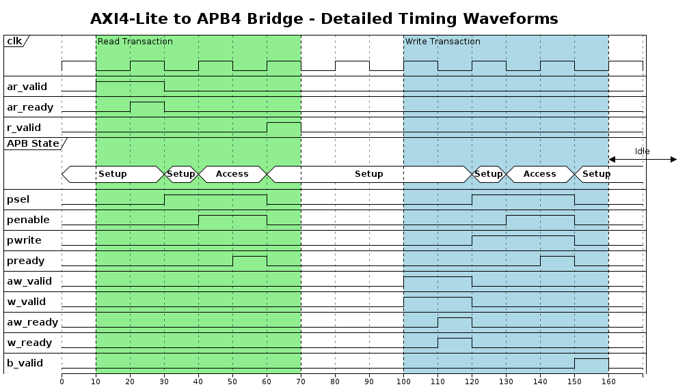

# AXI/APB Bridge UVM Verification Environment

A comprehensive, modular UVM verification infrastructure for AMBA protocol bridges with multi-phase development strategy.

## Overview

This project provides a scalable UVM verification environment for protocol conversion bridges:
- **Phase 1:** `axi_lite_to_apb` - AXI4-Lite to APB4 bridge ⭐ CURRENT
- **Phase 2:** `axi_to_axi_lite` - AXI4 Full to AXI4-Lite converter
- **Phase 3:** Integrated end-to-end AXI4 → APB4 verification

### Key Features

- ✅ Modular multi-phase verification strategy
- ✅ Full UVM methodology (planned)
- ✅ VCS simulation support
- ✅ Reference testbenches working (non-UVM)
- ✅ Complete PULP Platform infrastructure
- 🚧 UVM testbench in planning phase

## 📋 UVM Testbench Planning

**Current Status:** Architecture & Verification Planning Complete ✅

### Documentation
- **[UVM Testbench Architecture](docs/UVM_TESTBENCH_ARCHITECTURE.md)** - Complete system architecture, directory structure, and development roadmap
- **[Verification Plan](docs/VERIFICATION_PLAN.md)** - Detailed test plan, coverage strategy, and success criteria

### Three-Phase Development Strategy

```
Phase 1: axi_lite_to_apb (6 weeks)
  ├─ Week 1-2: Infrastructure & AXI-Lite agent
  ├─ Week 3-4: APB agent & Environment
  └─ Week 5-6: Tests & Coverage

Phase 2: axi_to_axi_lite (4-5 weeks)
  ├─ AXI4 Full agent development
  ├─ Burst splitting verification
  └─ ATOP handling tests

Phase 3: Integration (2-3 weeks)
  ├─ End-to-end AXI4 → APB4
  └─ Performance & stress testing
```

### Reusable Verification Components
- **AXI-Lite Agent:** Master driver, monitor, sequences
- **APB Agent:** Slave driver (with memory model), monitor
- **AXI4 Agent:** Full burst support (Phase 2)
- **Scoreboards:** Protocol-specific checking
- **Coverage:** Functional + code coverage infrastructure

## Dependencies

This project uses git submodules for dependency management. All dependencies are forked from PULP Platform for stability and customization.

### Complete Dependency Tree

```
deps/
├── apb/                     # APB4 protocol infrastructure
├── axi/                     # AXI4/AXI4-Lite protocol IP
├── common_cells/            # RTL building blocks
├── common_verification/     # Testbench utilities
└── iDMA/                    # DMA reference design
```

| Repository | Version | Purpose | Fork URL |
|------------|---------|---------|----------|
| **apb** | latest | APB4 interfaces & verification | [npcarter2025/apb](https://github.com/npcarter2025/apb) |
| **axi** | v1.x | AXI4/AXI-Lite IP | [npcarter2025/axi](https://github.com/npcarter2025/axi) |
| **common_cells** | v1.37.0 | FIFOs, arbiters, decoders | [npcarter2025/common_cells](https://github.com/npcarter2025/common_cells) |
| **common_verification** | v0.2.5 | Clock/reset gen, rand drivers | [npcarter2025/common_verification](https://github.com/npcarter2025/common_verification) |
| **iDMA** | v0.6.5 | DMA engine reference | [npcarter2025/iDMA](https://github.com/npcarter2025/iDMA) |

All dependencies use **Solderpad Hardware License v0.51** and are tracked as git submodules.

## Project Structure


```
axi-apb-bridge-uvm/
├── tb/                              # Testbench root
│   ├── agents/                      # Reusable UVM agents/VCs
│   │   ├── axi_lite_agent/          # AXI4-Lite agent
│   │   │   ├── axi_lite_pkg.sv                    # Package file (includes all below)
│   │   │   ├── axi_lite_if.sv                     # Interface (outside package)
│   │   │   ├── axi_lite_transaction.sv            # Transaction class ⭐
│   │   │   ├── axi_lite_config.sv                 # Agent configuration
│   │   │   ├── axi_lite_sequencer.sv              # Sequencer
│   │   │   ├── axi_lite_driver.sv                 # Driver
│   │   │   ├── axi_lite_monitor.sv                # Monitor
│   │   │   ├── axi_lite_coverage.sv               # Coverage collector (optional)
│   │   │   ├── axi_lite_agent.sv                  # Agent (top-level)
│   │   │   └── sequences/                         # Sequence library
│   │   │       ├── axi_lite_base_seq.sv
│   │   │       ├── axi_lite_random_seq.sv
│   │   │       ├── axi_lite_write_seq.sv
│   │   │       ├── axi_lite_read_seq.sv
│   │   │       └── axi_lite_directed_seq.sv
│   │   │
│   │   ├── apb_agent/               # APB4 agent
│   │   │   ├── apb_pkg.sv                         # Package file
│   │   │   ├── apb_if.sv                          # Interface (outside package)
│   │   │   ├── apb_transaction.sv                 # Transaction class ⭐
│   │   │   ├── apb_config.sv                      # Agent configuration
│   │   │   ├── apb_sequencer.sv                   # Sequencer
│   │   │   ├── apb_driver.sv                      # Driver (slave/master modes)
│   │   │   ├── apb_monitor.sv                     # Monitor
│   │   │   ├── apb_coverage.sv                    # Coverage collector (optional)
│   │   │   ├── apb_agent.sv                       # Agent (top-level)
│   │   │   └── sequences/                         # Sequence library
│   │   │       ├── apb_slave_seq.sv
│   │   │       ├── apb_master_seq.sv
│   │   │       └── apb_error_seq.sv
│   │   │
│   │   └── axi_agent/               # AXI4 Full agent (Phase 2)
│   │       └── [similar structure]
│   │
│   ├── env/                         # Test environments
│   │   ├── axi_lite_to_apb_env/     # Phase 1 environment ⭐
│   │   │   ├── axi_lite_to_apb_env_pkg.sv
│   │   │   ├── axi_lite_to_apb_env.sv
│   │   │   ├── axi_lite_to_apb_virtual_sequencer.sv  # Coordinates sequences
│   │   │   ├── axi_lite_to_apb_scoreboard.sv
│   │   │   ├── axi_lite_to_apb_predictor.sv          # Uses golden model
│   │   │   ├── axi_lite_to_apb_golden_model.sv       # DPI-C wrapper
│   │   │   └── axi_lite_to_apb_coverage.sv
│   │   │
│   │   ├── axi_to_axi_lite_env/     # Phase 2 environment
│   │   │   └── [similar structure]
│   │   │
│   │   └── integrated_env/          # Phase 3 full system
│   │       ├── integrated_virtual_sequencer.sv  # Top-level coordination
│   │       └── [combines both envs]
│   │
│   ├── tests/                       # Test library
│   │   ├── axi_lite_to_apb_tests/   # Phase 1 tests
│   │   │   ├── axi_lite_to_apb_base_test.sv
│   │   │   ├── axi_lite_to_apb_sanity_test.sv
│   │   │   ├── axi_lite_to_apb_random_test.sv
│   │   │   ├── axi_lite_to_apb_stress_test.sv
│   │   │   ├── axi_lite_to_apb_error_test.sv
│   │   │   └── axi_lite_to_apb_pipeline_test.sv
│   │   │
│   │   ├── axi_to_axi_lite_tests/   # Phase 2 tests
│   │   └── integrated_tests/        # Phase 3 tests
│   │
│   ├── top/                         # Top-level testbench files
│   │   ├── tb_axi_lite_to_apb_top.sv
│   │   ├── tb_axi_to_axi_lite_top.sv
│   │   └── tb_integrated_top.sv
│   │
│   ├── common/                      # Shared utilities
│   │   ├── tb_pkg.sv
│   │   ├── tb_params.sv
│   │   └── tb_utils.sv
│   │
│   ├── ral/                         # Register Abstraction Layer (Optional)
│   │   ├── apb_reg_model.sv         # RAL for APB slave registers
│   │   ├── apb_reg_adapter.sv       # APB RAL adapter
│   │   └── reg_sequences/           # Register access sequences
│   │       ├── reg_hw_reset_seq.sv
│   │       ├── reg_bit_bash_seq.sv
│   │       └── reg_access_seq.sv
│   │
│   └── dpi/                         # DPI-C Components
│       ├── memory/                  # Memory model (for APB slave)
│       │   ├── dpi_memory.sv
│       │   ├── dpi_memory.h
│       │   └── dpi_memory.c
│       └── golden_model/            # Golden reference model ⭐
│           ├── bridge_golden_model.sv   # SV wrapper
│           ├── bridge_golden_model.h    # C header
│           ├── bridge_golden_model.c    # C implementation
│           └── Makefile                 # Compile C code
│
├── sim/                             # Simulation scripts
│   ├── Makefile.uvm                 # UVM-specific Makefile
│   ├── compile_uvm.f                # UVM compilation filelist
│   ├── files/
│   │   └── uvm/
│   │       ├── agents.f
│   │       ├── env.f
│   │       └── tests.f
│   └── scripts/
│       ├── run_uvm_test.sh
│       └── regression.sh
│
└── docs/
    ├── UVM_TESTBENCH_ARCHITECTURE.md  # This document
    ├── VERIFICATION_PLAN.md
    └── COVERAGE_PLAN.md
```

# DUT







### Component Interaction Diagram


```
┌─────────────────────────────────────────────────────────────────┐
│                    UVM ENVIRONMENT                              │
│                                                                 │
│  ┌──────────────────────────────────────────────────────┐     │
│  │         Virtual Sequencer (Phase 1 Optional)         │     │
│  │  ┌────────────────┐         ┌────────────────┐      │     │
│  │  │ AXI-Lite Seqr  │         │   APB Seqr     │      │     │
│  │  │   (ref)        │         │   (ref)        │      │     │
│  │  └───────┬────────┘         └────────┬───────┘      │     │
│  └──────────┼──────────────────────────┼──────────────┘     │
│             │                           │                     │
│  ┌──────────▼────────┐       ┌─────────▼────────┐           │
│  │  AXI-Lite Agent   │       │    APB Agent      │           │
│  │  ┌──────────────┐ │       │  ┌──────────────┐│           │
│  │  │ Sequencer    │ │       │  │ Sequencer    ││           │
│  │  ├──────────────┤ │       │  ├──────────────┤│           │
│  │  │ Driver       │ │       │  │ Driver       ││           │
│  │  │              │ │       │  │ (Slave mode) ││           │
│  │  │              │ │       │  │  ┌─────────┐ ││           │
│  │  │              │ │       │  │  │ Memory  │ ││           │
│  │  │              │ │       │  │  │ Model   │ ││           │
│  │  │              │ │       │  │  │         │ ││           │
│  │  │              │ │       │  │  │ DPI-C   │ ││ ◄─ Optional
│  │  │              │ │       │  │  │ or SV   │ ││           │
│  │  │              │ │       │  │  └─────────┘ ││           │
│  │  ├──────────────┤ │       │  ├──────────────┤│           │
│  │  │ Monitor      │ │       │  │ Monitor      ││           │
│  │  └──────────────┘ │       │  └──────────────┘│           │
│  └───────────────────┘       └───────────────────┘           │
│                                                               │
│  ┌──────────────────────────────────────────────────────┐   │
│  │  RAL (Optional - for register-based APB slaves)      │   │
│  │  ┌────────────┐  ┌──────────┐  ┌────────────────┐   │   │
│  │  │ Reg Model  │  │ Adapter  │  │  Predictor     │   │   │
│  │  └────────────┘  └──────────┘  └────────────────┘   │   │
│  └──────────────────────────────────────────────────────┘   │
│                                                               │
└─────────────────────────────────────────────────────────────┘
```
### AMD-Style Organization

This project follows AMD's modular verification structure:
- **Tool-agnostic design** - Easy to add support for QuestaSim, Xcelium, etc.
- **Modular filelists** - Dependencies separated from DUT and testbench
- **Clean separation** - Build artifacts isolated in `sim/`
- **Scalable** - Ready for UVM and regression frameworks


### Quick Test

Verify the setup with the reference testbench:

```bash
# Option 1: Use convenience script (recommended)
./sim/scripts/run_vcs.sh quick

# Option 2: Use Makefile directly
cd sim
make vcs

# Run all test configurations
./sim/scripts/run_vcs.sh all
# or
cd sim && make vcs_all
```

### Expected Output

```
✅ Compilation successful!
✅ Simulation PASSED (Pipeline=0/0)
   Completed 20000 reads and 10000 writes
```

## Development

### Adding UVM Testbench (Coming Soon)

The project structure is ready for UVM testbench development:

```
tb/                       # UVM testbench (to be created)
├── agents/
│   ├── axi_lite/        # AXI-Lite UVM agent
│   └── apb/             # APB UVM agent
├── env/                 # UVM environment
├── sequences/           # UVM sequences
├── tests/               # UVM tests
└── tb_top.sv            # Testbench top module
```

### Updating Dependencies

To update to newer versions of dependencies:

```bash
# Update axi submodule
cd deps/axi
git fetch origin
git checkout v0.40.0  # Or desired version
cd ../..
git add deps/axi
git commit -m "Update axi to v0.40.0"

# Similar for common_cells
cd deps/common_cells
git fetch origin
git checkout v1.40.0
cd ../..
git add deps/common_cells
git commit -m "Update common_cells to v1.40.0"
```

## Running Tests

### VCS Simulation

```bash
# Using convenience script (from project root)
./sim/scripts/run_vcs.sh quick          # Quick test
./sim/scripts/run_vcs.sh all            # All 4 configs
./sim/scripts/run_vcs.sh pipe11         # Full pipeline

# Using Makefile directly (from sim/ directory)
cd sim
make vcs                                # Quick test
make vcs PIPE_REQ=1 PIPE_RESP=1         # With pipelining
make vcs_all                            # All 4 configurations
make debug                              # Debug with DVE GUI
make clean                              # Clean build artifacts

# View help
cd sim && make help
./sim/scripts/run_vcs.sh help
```

### Parameters

| Parameter | Default | Description |
|-----------|---------|-------------|
| `PIPE_REQ` | 0 | Pipeline request path (0/1) |
| `PIPE_RESP` | 0 | Pipeline response path (0/1) |

## Documentation


- **[STRUCT_REFERENCE.md](docs/STRUCT_REFERENCE.md)** - All struct definitions


## Design Under Test

### Module: `axi_lite_to_apb`

**Function:** Converts AXI4-Lite transactions to APB4 protocol

**Parameters:**
- `NoApbSlaves`: Number of APB slaves (default: 1)
- `AddrWidth`: Address bus width (default: 32)
- `DataWidth`: Data bus width (default: 32)
- `PipelineRequest`: Pipeline request path (default: 0)
- `PipelineResponse`: Pipeline response path (default: 0)

**Features:**
- Address decoding for multiple APB slaves
- Burst splitting (AXI-Lite to APB single transfers)
- Error handling and propagation
- Optional request/response pipelining

## License

This verification environment uses components under the Solderpad Hardware License v0.51:
- AXI IP: © 2019 ETH Zurich and University of Bologna
- Common Cells: © 2018 ETH Zurich and University of Bologna

See individual source files and dependencies for complete license information.

## References

- **PULP Platform:** https://pulp-platform.org/
- **AXI Specification:** ARM AMBA AXI Protocol Specification
- **APB Specification:** ARM AMBA APB Protocol Specification
- **UVM Methodology:** Universal Verification Methodology

## Author

**Nathan Carter** (npcarter2025)  
Universal Verification Methodology Project  
Date: January 2026

## Acknowledgments

- PULP Platform team for the AXI and Common Cells IP
- ETH Zurich for the original bridge design
- University of Bologna for verification infrastructure

---

**Status:** ✅ Reference testbench verified and passing  
**Next:** UVM testbench development in progress
