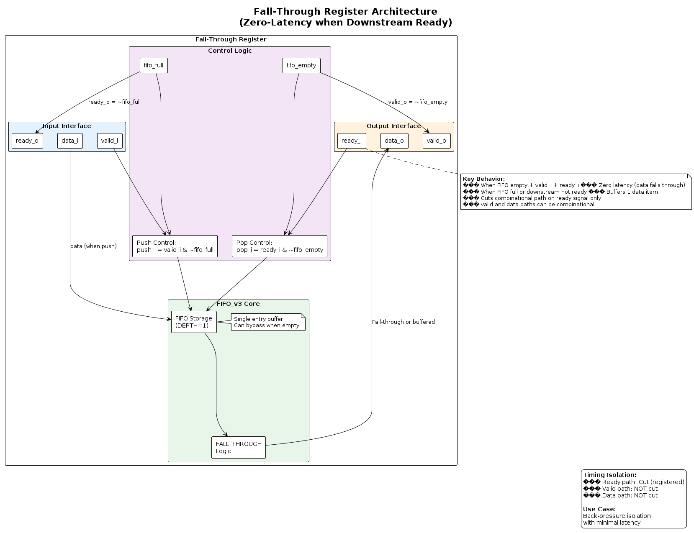
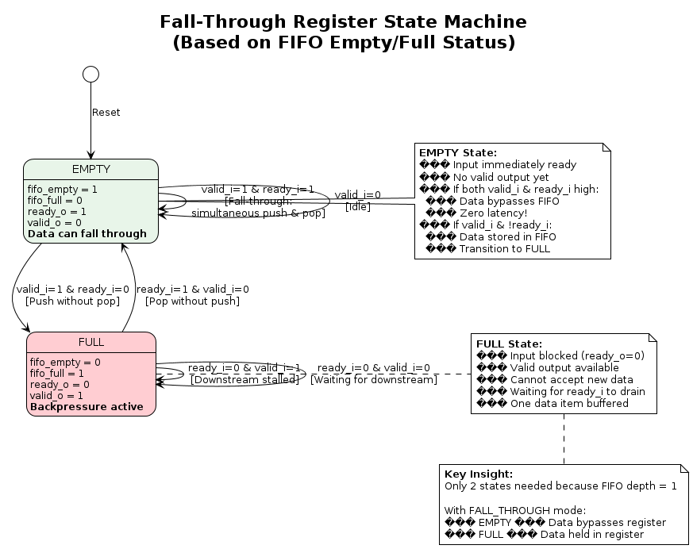
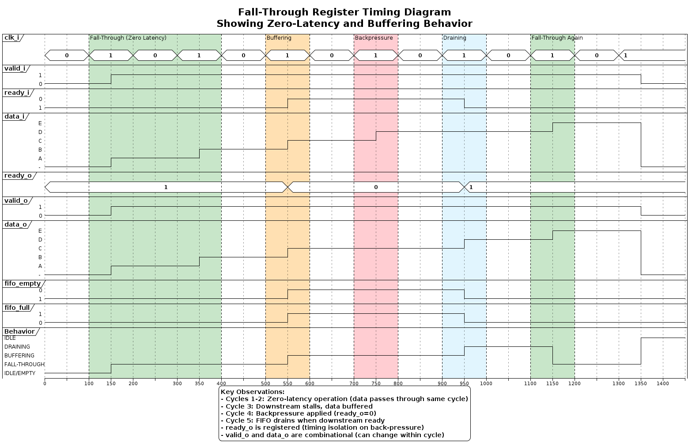
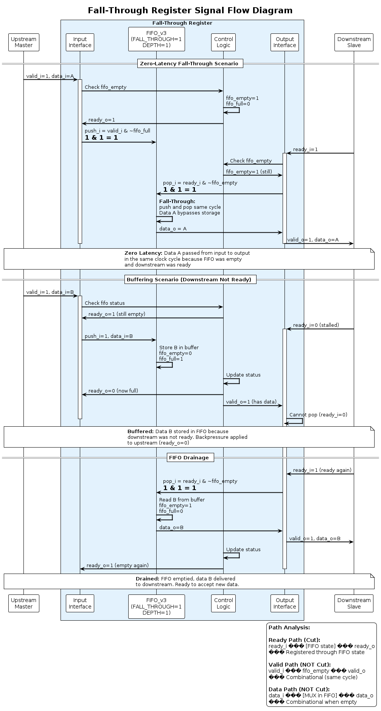

# Fall-Through Register Diagrams

This directory contains comprehensive PlantUML diagrams documenting the `fall_through_register` module from the common_cells library.

## Overview

The fall-through register is a pipeline register that provides **zero-latency** data transfer when the downstream is ready, while cutting the combinational path on the ready signal for timing isolation.

## Diagrams

### 1. Architecture Diagram (`architecture.puml`)
**Purpose:** Shows the internal structure and component hierarchy

**Key Features Illustrated:**
- FIFO_v3 instantiation with FALL_THROUGH=1 and DEPTH=1
- Signal routing and connections
- Control logic for push/pop operations
- Relationship between fifo_full/fifo_empty and ready_o/valid_o

**When to Reference:** Understanding the module's internal implementation and how signals flow between components.



---

### 2. FSM Diagram (`fsm.puml`)
**Purpose:** State machine representation based on FIFO status

**States:**
- **EMPTY**: FIFO empty, ready to accept, no valid output
  - Zero-latency fall-through possible in this state
- **FULL**: FIFO full, backpressure active, valid output available

**Transitions:**
- Shows how valid_i, ready_i, and FIFO state interact
- Explains when data bypasses vs. when it's buffered

**When to Reference:** Understanding behavioral modes and when fall-through occurs vs. buffering.


---

### 3. Timing Diagram (`timing.puml`)
**Purpose:** Cycle-by-cycle timing behavior showing both fall-through and buffering scenarios

**Scenarios Shown:**
1. **Zero-latency fall-through** (cycles 1-2)
   - Data passes through in same cycle when FIFO empty and ready_i=1
2. **Buffering on backpressure** (cycle 3)
   - Downstream stalls, data buffered in FIFO
3. **Backpressure propagation** (cycle 4)
   - FIFO full, ready_o drops, input blocked
4. **FIFO drainage** (cycle 5)
   - Downstream ready again, FIFO empties

**When to Reference:** Understanding timing behavior, latency characteristics, and how backpressure works.


---

### 4. Signal Flow Diagram (`signal_flow.puml`)
**Purpose:** Data and control signal flow with path analysis

**Key Information:**
- Push/pop control equations
- Ready/valid handshake logic
- Combinational path analysis:
  - ✓ Ready path is CUT (registered)
  - ✗ Valid path is NOT CUT (combinational)
  - ✗ Data path is NOT CUT (combinational when empty)

**When to Reference:** Timing closure analysis, understanding which paths are isolated and which are combinational.


---

## Key Characteristics

| Characteristic | Value |
|----------------|-------|
| **Latency** | Zero when downstream ready, 1 cycle when buffered |
| **Buffering Capacity** | 1 data item |
| **Ready Path** | Cut (registered) |
| **Valid Path** | NOT cut (combinational) |
| **Data Path** | NOT cut (can be combinational) |
| **Use Case** | Back-pressure isolation with minimal latency |

## Comparison with Spill Register

| Feature | Fall-Through Register | Spill Register |
|---------|----------------------|----------------|
| **Min Latency** | 0 cycles | 1 cycle |
| **Max Buffering** | 1 item | 2 items |
| **Valid Path** | Combinational | Registered |
| **Data Path** | Can be combinational | Registered |
| **Ready Path** | Registered | Registered |
| **Use Case** | Minimal latency | Complete isolation |

## Viewing the Diagrams

### Online Viewers
- [PlantUML Online Editor](http://www.plantuml.com/plantuml/uml/)
- [PlantText](https://www.planttext.com/)

### Local Rendering
```bash
# Using PlantUML JAR
java -jar plantuml.jar *.puml

# Using VS Code with PlantUML extension
# Just open the .puml file and use preview
```

### Command Line (with plantuml installed)
```bash
plantuml -tpng *.puml
```

## Source Files

- **Module:** `deps/common_cells/src/fall_through_register.sv`
- **Underlying FIFO:** `deps/common_cells/src/fifo_v3.sv`

## Related Documentation

- See `../spill_register/` for diagrams of the complementary spill register
- See main AXI_TO_APB_BRIDGE_UVM documentation for usage in the bridge
