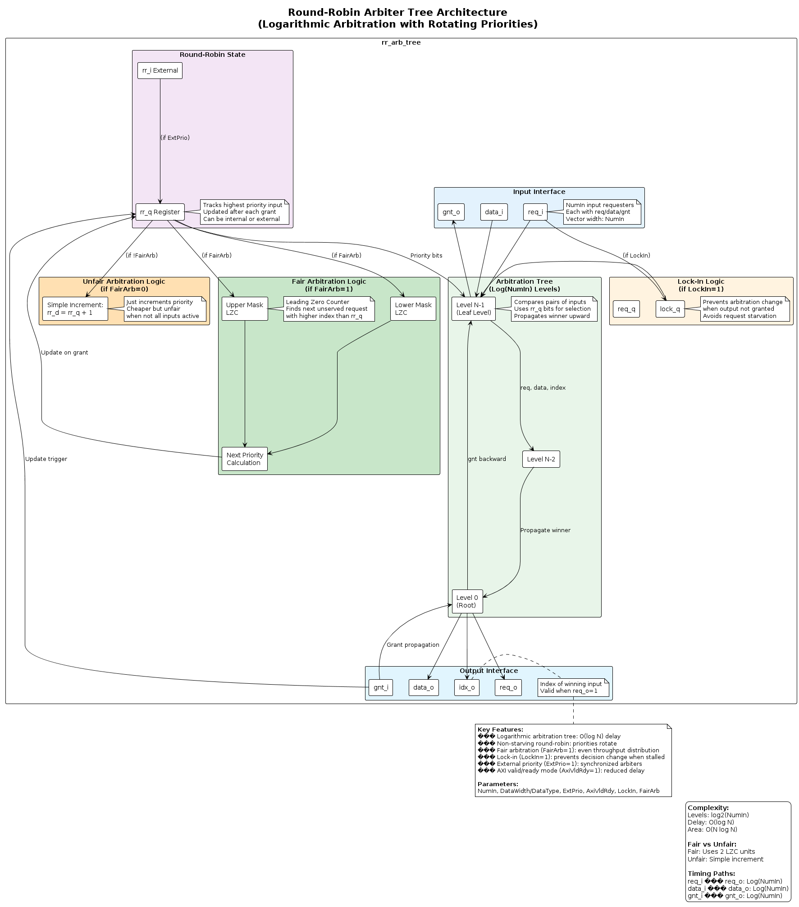
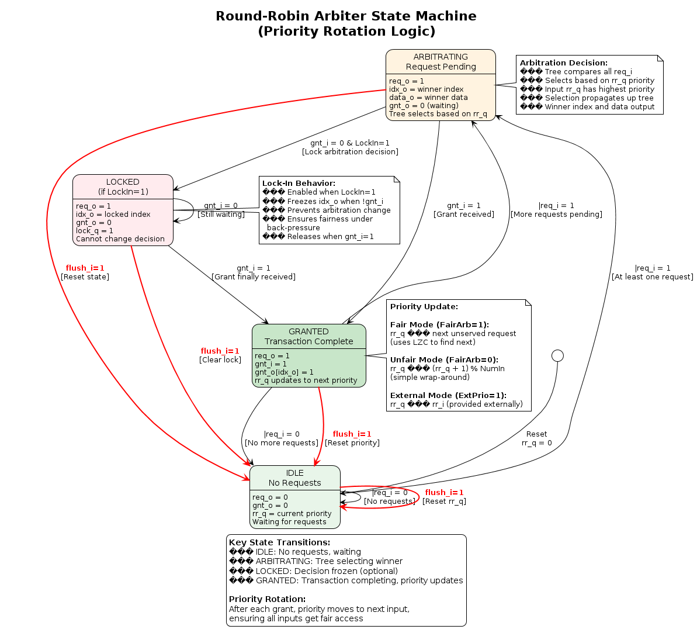
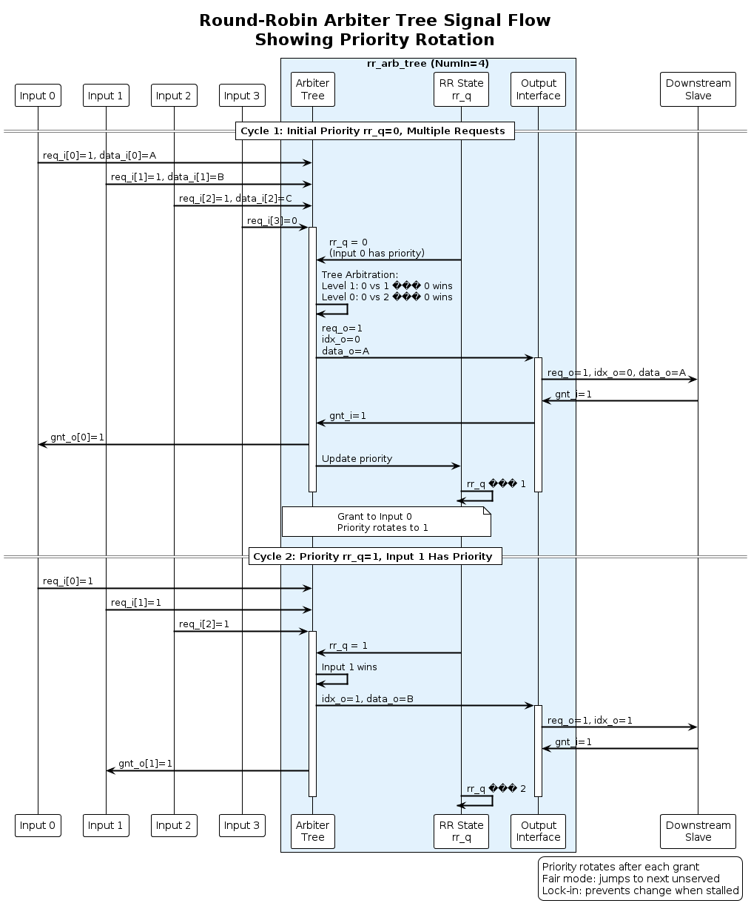
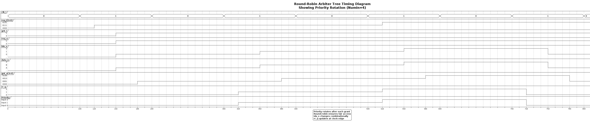

# Round-Robin Arbiter Tree Diagrams

This directory contains comprehensive PlantUML diagrams documenting the `rr_arb_tree` module from the common_cells library.

## Overview

The round-robin arbiter tree is a **logarithmic arbitration structure** with rotating priorities that ensures **non-starving fair access** for all inputs. It implements a tree-based arbitration with O(log N) delay.

## Diagrams

### 1. Architecture Diagram (`architecture.puml`)
**Purpose:** Shows the tree structure and priority management

**Key Features Illustrated:**
- Input interface (req_i, data_i, gnt_o vectors)
- Round-robin state register (rr_q)
- Fair arbitration logic (2 LZC units)
- Unfair arbitration logic (simple increment)
- Lock-in mechanism (optional)
- Logarithmic tree structure
- Output interface (req_o, data_o, idx_o)

**When to Reference:** Understanding the overall architecture and parameter options.



---

### 2. FSM Diagram (`fsm.puml`)
**Purpose:** State machine for priority rotation and locking

**States:**
1. **IDLE** - No requests, waiting
2. **ARBITRATING** - Request pending, tree selecting winner
3. **LOCKED** (optional) - Decision frozen until grant
4. **GRANTED** - Transaction completing, priority updates

**Key Transitions:**
- Normal arbitration flow
- Lock-in behavior when downstream stalls
- Priority update mechanisms (fair vs unfair)
- Flush transitions

**When to Reference:** Understanding arbitration states and priority rotation logic.



---

### 3. Signal Flow Diagram (`signal_flow.puml`)
**Purpose:** Sequence showing round-robin priority rotation

**Scenarios Shown:**
1. **Cycle 1**: Priority at 0, Input 0 wins
2. **Cycle 2**: Priority rotates to 1, Input 1 wins
3. **Cycle 3**: Priority rotates to 2, Input 2 wins
4. **Lock-In**: Decision frozen when downstream not ready

**Key Information:**
- Tree arbitration at each level
- Priority rotation after grants
- Lock-in preventing priority change

**When to Reference:** Understanding how priorities rotate and decisions are made.



---

### 4. Timing Diagram (`timing.puml`)
**Purpose:** Cycle-by-cycle timing showing priority rotation

**Scenarios Shown:**
1. Normal round-robin operation
2. Priority rotation through inputs
3. Priority wrap-around
4. Lock-in scenario when stalled
5. Grant propagation

**When to Reference:** Understanding exact timing of arbitration and grants.



---

## Key Characteristics

| Characteristic | Value |
|----------------|-------|
| **Arbitration Scheme** | Round-robin (rotating priorities) |
| **Complexity** | O(log N) levels |
| **Delay** | Logarithmic in NumIn |
| **Area** | O(N log N) |
| **Starvation** | Non-starving (all inputs served) |
| **Fairness** | Configurable (FairArb parameter) |
| **Lock-In** | Optional (LockIn parameter) |

## Parameters

| Parameter | Type | Default | Description |
|-----------|------|---------|-------------|
| `NumIn` | int unsigned | 64 | Number of inputs to arbitrate |
| `DataWidth` | int unsigned | 32 | Data width in bits |
| `DataType` | type | logic[DataWidth-1:0] | Data type (overrides DataWidth) |
| `ExtPrio` | bit | 1'b0 | External priority control via rr_i |
| `AxiVldRdy` | bit | 1'b0 | AXI-style valid/ready handshake |
| `LockIn` | bit | 1'b0 | Prevent arbitration change when stalled |
| `FairArb` | bit | 1'b1 | Fair throughput distribution |

## Arbitration Modes

### Fair Arbitration (FairArb=1)
**Behavior:**
- Priority jumps to next **unserved** request
- Uses two leading-zero counters (LZC)
- Ensures even throughput distribution
- Even when not all inputs active

**Implementation:**
```systemverilog
upper_mask[i] = (i >  rr_q) ? req_d[i] : 1'b0;  // Higher priority
lower_mask[i] = (i <= rr_q) ? req_d[i] : 1'b0;  // Lower/equal priority

next_idx = upper_empty ? lower_idx : upper_idx;  // Wrap-around
rr_d = (gnt_i && req_o) ? next_idx : rr_q;
```

**Complexity:**
- Area: 2 LZC units + masking logic + mux
- Timing: log(log(NumIn)) for LZC

---

### Unfair Arbitration (FairArb=0)
**Behavior:**
- Priority simply increments by 1
- Wraps around at NumIn
- Simpler and cheaper
- Unfair if not all inputs active

**Implementation:**
```systemverilog
rr_d = (gnt_i && req_o) ? 
       ((rr_q == idx_t'(NumIn-1)) ? '0 : rr_q + 1'b1) : rr_q;
```

**Complexity:**
- Area: Single adder + comparator
- Timing: Constant (faster than fair mode)

---

## Lock-In Feature (LockIn=1)

### Purpose
Prevents arbitration decision from changing when the downstream is not ready (gnt_i=0).

### Behavior
1. First arbitration cycle: Winner selected
2. If gnt_i=0: Decision **locked**, idx_o frozen
3. While locked: idx_o remains constant even if higher priority requests arrive
4. When gnt_i=1: Lock released, priority advances

### Use Case
- Ensures fairness under back-pressure
- Prevents request starvation
- Important for systems with variable downstream latency

### Implementation
```systemverilog
lock_d = req_o & ~gnt_i;           // Lock when request but no grant
req_d = (lock_q) ? req_q : req_i;  // Use locked requests
```

---

## External Priority (ExtPrio=1)

### Purpose
Allows multiple arbiters to operate with synchronized priorities.

### Behavior
- Priority provided via `rr_i` input
- Internal `rr_q` register not used
- Multiple arbiters can use same `rr_i`
- Useful for hierarchical arbitration

### Note
- **Cannot use with LockIn** (assertion checks this)
- For static priority: connect `rr_i` to constant value

---

## AXI Valid/Ready Mode (AxiVldRdy=1)

### Purpose
Reduces delay and area for AXI-style handshakes.

### Behavior
- Assumes upstream `req` (valid) does not depend on `gnt` (ready)
- Allows simplification of grant logic
- Reduces combinational path length

### Grant Logic Simplification
```systemverilog
// Without AxiVldRdy:
gnt_o[i] = gnt_nodes[idx] & req_d[i] & sel

// With AxiVldRdy:
gnt_o[i] = gnt_nodes[idx] & sel  // Simpler!
```

---

## Tree Structure

### Levels
```
NumIn inputs → log2(NumIn) levels → 1 output

Example: NumIn=8
Level 2 (leaf):   [0 vs 1]  [2 vs 3]  [4 vs 5]  [6 vs 7]
Level 1:          [0/1 vs 2/3]       [4/5 vs 6/7]
Level 0 (root):   [0/1/2/3 vs 4/5/6/7]
```

### Arbitration at Each Level
- Compare two inputs (or sub-tree results)
- Use `rr_q` bit for this level to select
- Winner propagates to next level
- Grant propagates backward from root

### Selection Logic
```systemverilog
sel = ~req_left | req_right & rr_q[level_bit];

// Prefers left unless:
// - Left not requesting AND right is, OR
// - Both requesting AND rr_q bit says pick right
```

---

## Timing Characteristics

| Path | Delay |
|------|-------|
| **req_i → req_o** | O(log N) through tree |
| **data_i → data_o** | O(log N) mux chain |
| **gnt_i → gnt_o** | O(log N) back-propagation |
| **req_i → rr_q** | log(log N) LZC (fair mode) |
| **rr_q → tree** | Distributed to all levels |

**Critical Path:** Usually data_i → data_o

---

## Assertions

The module includes comprehensive assertions:

```systemverilog
ASSERT(hot_one, $onehot0(gnt_o))         // Grant is one-hot or zero
ASSERT(gnt0, |gnt_o |-> gnt_i)           // Grant out implies grant in
ASSERT(gnt1, req_o |-> gnt_i |-> |gnt_o) // Req+gnt implies grant out
ASSERT(req0, |req_i |-> req_o)           // Req in implies req out
ASSERT(req1, req_o |-> |req_i)           // Req out implies req in
```

---

## Usage Examples

### Simple Round-Robin Arbiter
```systemverilog
rr_arb_tree #(
  .NumIn(4),
  .DataWidth(32),
  .FairArb(1'b1)
) arbiter (
  .clk_i, .rst_ni,
  .flush_i(1'b0),
  .req_i(/* 4 requests */),
  .gnt_o(/* 4 grants */),
  .data_i(/* 4 data inputs */),
  .req_o, .gnt_i,
  .data_o, .idx_o
);
```

### With Lock-In for Back-Pressure
```systemverilog
rr_arb_tree #(
  .NumIn(8),
  .DataWidth(64),
  .LockIn(1'b1),    // Enable lock-in
  .FairArb(1'b1)
) arbiter (...);
```

### Static Priority (Highest Input First)
```systemverilog
rr_arb_tree #(
  .NumIn(4),
  .ExtPrio(1'b1)
) arbiter (
  ...
  .rr_i('0),  // Always prioritize input 0
  ...
);
```

---

## Viewing the Diagrams

### Online Viewers
- [PlantUML Online Editor](http://www.plantuml.com/plantuml/uml/)
- [PlantText](https://www.planttext.com/)

### Local Rendering
```bash
# Using PlantUML JAR
java -jar plantuml.jar *.puml

# Using VS Code with PlantUML extension
# Open .puml file and use preview

# Command line
plantuml -tpng *.puml
```

## Source Files

- **Module:** `deps/common_cells/src/rr_arb_tree.sv`
- **Dependencies:** `lzc` (Leading Zero Counter) for fair arbitration

## Related Documentation

- See `../fall_through_register/` and `../spill_register/` for pipeline registers
- See main AXI_TO_APB_BRIDGE_UVM documentation for usage in bridge arbitration
