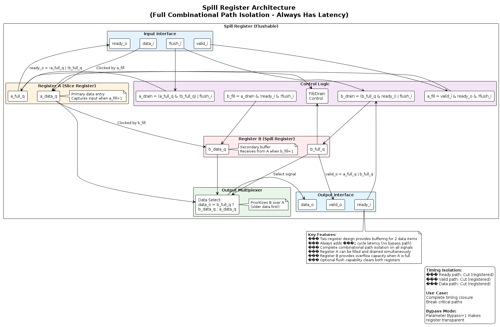
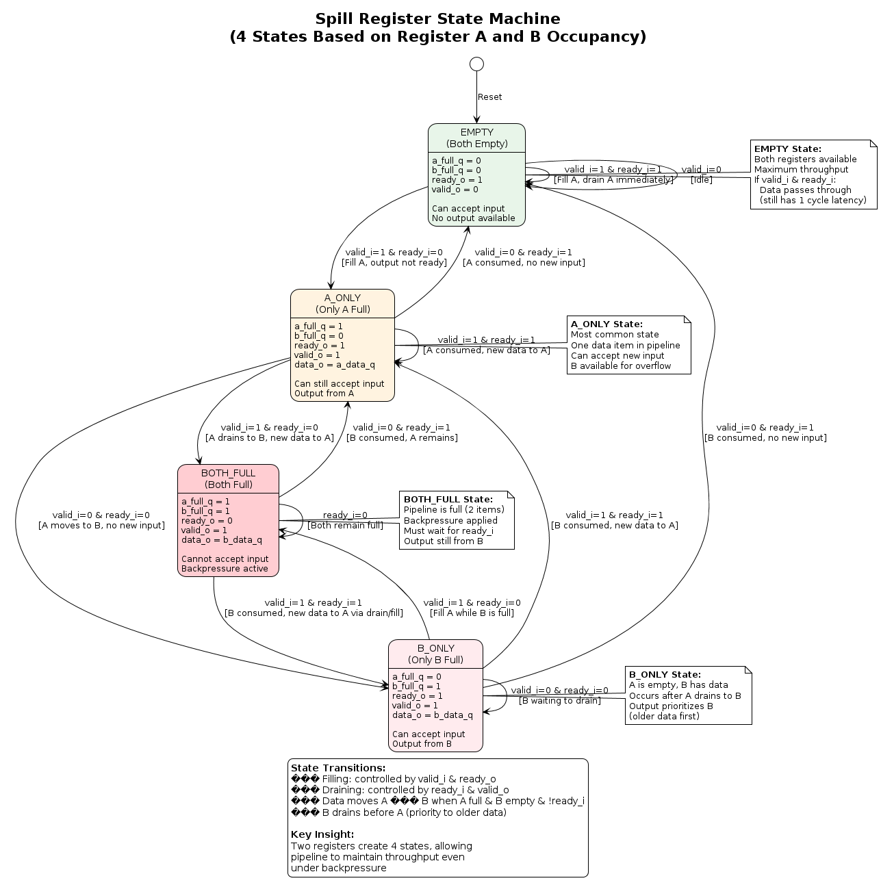
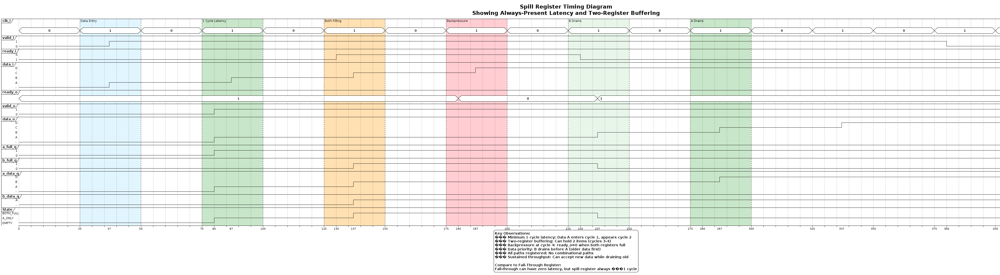
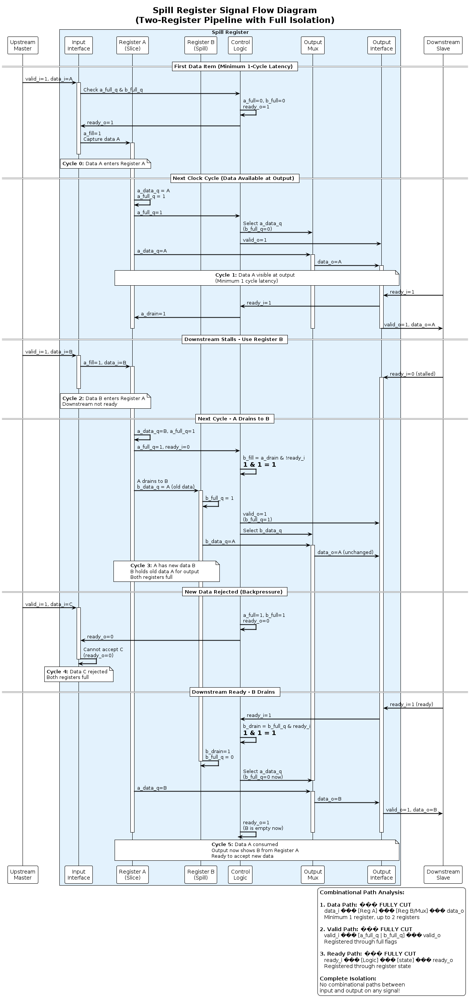

# Spill Register Diagrams

This directory contains comprehensive PlantUML diagrams documenting the `spill_register` and `spill_register_flushable` modules from the common_cells library.

## Overview

The spill register is a two-register pipeline stage that provides **complete combinational path isolation** between input and output on all signals (ready, valid, and data). This comes at the cost of always having at least 1 cycle of latency.

## Diagrams

### 1. Architecture Diagram (`architecture.puml`)
**Purpose:** Shows the internal two-register structure and data flow

**Key Features Illustrated:**
- Register A (Slice Register) - primary data entry point
- Register B (Spill Register) - overflow/secondary buffer
- Control logic for fill/drain operations
- Output multiplexer prioritizing B over A
- Control equations for a_fill, a_drain, b_fill, b_drain

**When to Reference:** Understanding the dual-register architecture and how data moves between stages.



---

### 2. FSM Diagram (`fsm.puml`)
**Purpose:** Four-state machine based on register occupancy

**States:**
1. **EMPTY** (a_full=0, b_full=0)
   - Both registers empty
   - ready_o=1, valid_o=0
   - Maximum input capacity

2. **A_ONLY** (a_full=1, b_full=0)
   - Only register A has data
   - ready_o=1, valid_o=1
   - Most common operating state
   - Output from A

3. **B_ONLY** (a_full=0, b_full=1)
   - Only register B has data
   - ready_o=1, valid_o=1
   - Can still accept input
   - Output from B (older data)

4. **BOTH_FULL** (a_full=1, b_full=1)
   - Both registers occupied
   - ready_o=0, valid_o=1
   - Backpressure active
   - Output from B (FIFO ordering)

**When to Reference:** Understanding state transitions and when backpressure occurs.



---

### 3. Timing Diagram (`timing.puml`)
**Purpose:** Detailed cycle-by-cycle behavior showing latency and buffering

**Scenarios Shown:**
1. **Minimum latency** (cycles 1-2)
   - Data enters cycle 1, appears at output cycle 2
   - Always ≥1 cycle delay
2. **Two-register buffering** (cycles 3-4)
   - Both registers full, holding 2 data items
   - Backpressure applied when both full
3. **Prioritized drainage** (cycles 5-7)
   - B drains before A (older data first)
   - Maintains FIFO ordering
4. **Sustained throughput**
   - Can accept new data while draining old
   - Pipeline efficiency

**When to Reference:** Understanding timing behavior, latency guarantees, and buffering capacity.



---

### 4. Signal Flow Diagram (`signal_flow.puml`)
**Purpose:** Complete signal routing and combinational path analysis

**Key Information:**
- Data path: Input → Reg A → Reg B/Mux → Output
- Control signal feedback loops
- Fill/drain control equations
- Output multiplexer selection logic
- Complete path isolation analysis:
  - ✓ Ready path is CUT (registered)
  - ✓ Valid path is CUT (registered)
  - ✓ Data path is CUT (registered)

**When to Reference:** Timing closure verification, understanding complete signal isolation.



---

## Key Characteristics

| Characteristic | Value |
|----------------|-------|
| **Minimum Latency** | 1 cycle (always present) |
| **Buffering Capacity** | 2 data items (A + B) |
| **Ready Path** | Cut (registered) |
| **Valid Path** | Cut (registered) |
| **Data Path** | Cut (registered) |
| **Use Case** | Complete timing isolation, breaking critical paths |

## Two-Register Operation

### Data Movement
1. **Input → Register A**: Data enters when valid_i & ready_o
2. **Register A → Register B**: When A full, B empty, and output not ready
3. **Output**: Prioritizes B (older data), then A if B empty

### Buffering Advantage
The two-register design allows:
- **Continuous acceptance**: Can accept new data into A while B holds previous data
- **Pipeline efficiency**: Minimizes stalls by providing overflow capacity
- **Complete isolation**: All paths broken by at least one register

## Comparison with Fall-Through Register

| Feature | Spill Register | Fall-Through Register |
|---------|---------------|----------------------|
| **Min Latency** | 1 cycle (always) | 0 cycles (when ready) |
| **Max Latency** | 2+ cycles | 1 cycle |
| **Max Buffering** | 2 items | 1 item |
| **Valid Path** | Registered ✓ | Combinational ✗ |
| **Data Path** | Registered ✓ | Can be combinational ✗ |
| **Ready Path** | Registered ✓ | Registered ✓ |
| **Use Case** | Timing closure | Minimal latency |
| **Timing Isolation** | Complete | Partial (ready only) |

## When to Use Spill Register

Choose spill register when:
- ✓ Timing paths are critical and must be broken
- ✓ Need complete combinational isolation
- ✓ Latency is acceptable (≥1 cycle okay)
- ✓ Need maximum buffering capacity (2 items)
- ✓ Synthesis reports timing violations

Choose fall-through register when:
- ✓ Latency must be minimized
- ✓ Only ready path needs isolation
- ✓ Data/valid paths can remain combinational
- ✓ Single-item buffering sufficient

## Module Hierarchy

```
spill_register
└── spill_register_flushable (actual implementation)
    ├── gen_bypass (if Bypass=1)
    │   └── Direct connections (transparent)
    └── gen_spill_reg (if Bypass=0)
        ├── Register A (slice)
        ├── Register B (spill)
        └── Control logic
```

## Viewing the Diagrams

### Online Viewers
- [PlantUML Online Editor](http://www.plantuml.com/plantuml/uml/)
- [PlantText](https://www.planttext.com/)

### Local Rendering
```bash
# Using PlantUML JAR
java -jar plantuml.jar *.puml

# Using VS Code with PlantUML extension
# Just open the .puml file and use preview

# Command line
plantuml -tpng *.puml
```

## Source Files

- **Wrapper Module:** `deps/common_cells/src/spill_register.sv`
- **Implementation:** `deps/common_cells/src/spill_register_flushable.sv`

## Parameters

| Parameter | Type | Default | Description |
|-----------|------|---------|-------------|
| `T` | type | logic | Data type for the register |
| `Bypass` | bit | 1'b0 | If 1, makes register transparent (no isolation) |

## Advanced Features

### Bypass Mode
When `Bypass=1`:
- All isolation removed
- Direct combinational connections
- Zero latency
- Use for conditional timing closure

### Flush Capability
The `spill_register_flushable` supports:
- Asynchronous flush of both registers
- Immediate clearing of pipeline
- **Warning**: flush_i and valid_i must not be high simultaneously

## Related Documentation

- See `../fall_through_register/` for zero-latency alternative
- See main AXI_TO_APB_BRIDGE_UVM documentation for usage in the bridge
