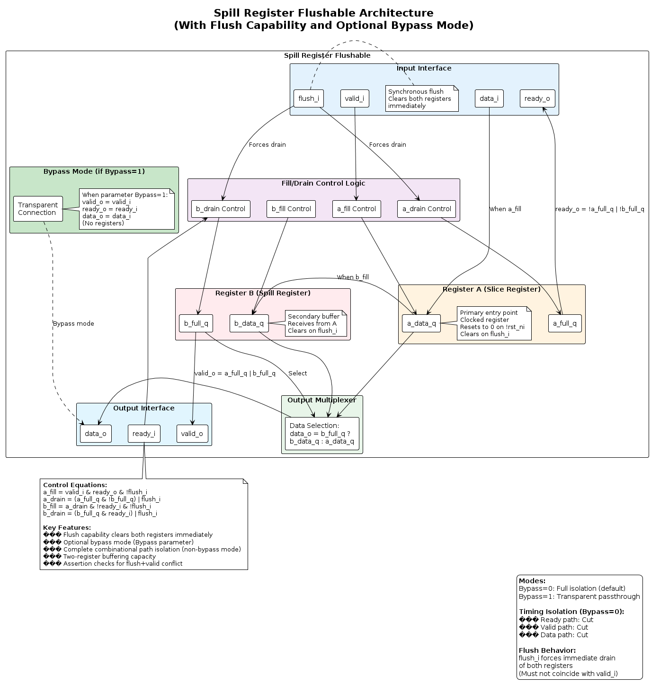
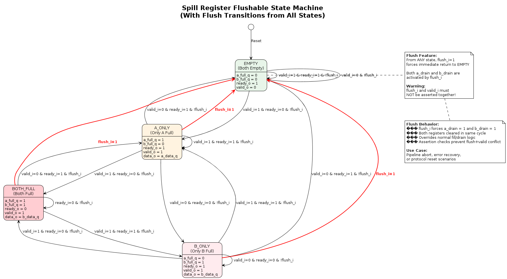
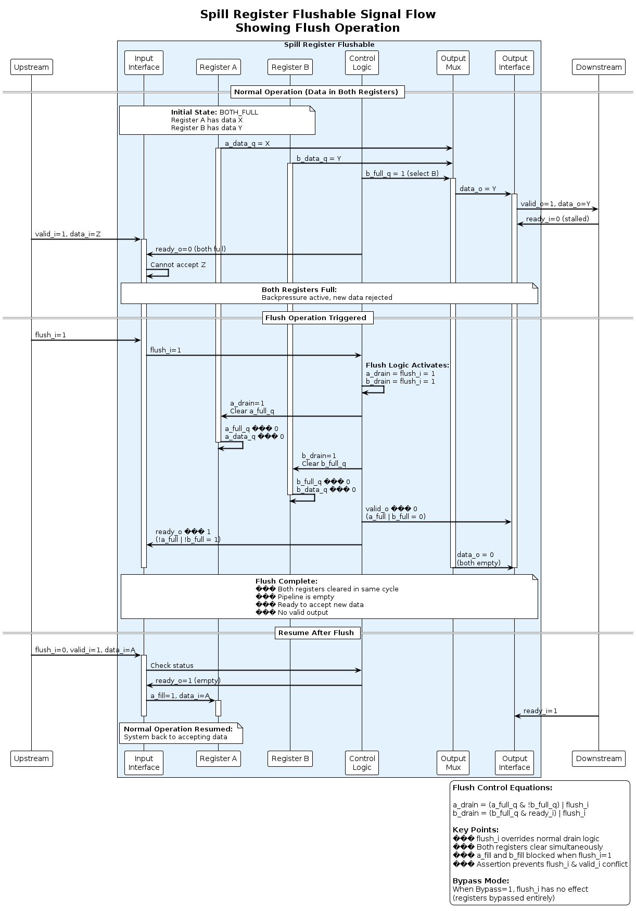
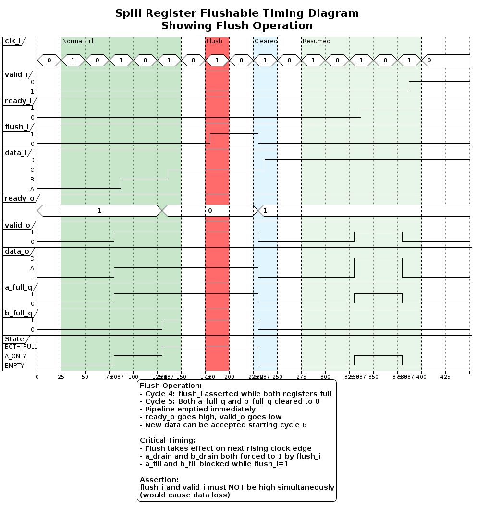

# Spill Register Flushable Diagrams

This directory contains comprehensive PlantUML diagrams documenting the `spill_register_flushable` module from the common_cells library.

## Overview

The spill register flushable is a two-register pipeline stage with **complete combinational path isolation** and **flush capability**. It provides an optional bypass mode for conditional timing closure.

## Diagrams

### 1. Architecture Diagram (`architecture.puml`)
**Purpose:** Shows the internal two-register structure with flush logic

**Key Features Illustrated:**
- Register A (Slice Register) - primary data entry
- Register B (Spill Register) - overflow buffer
- Flush capability affecting both registers
- Optional bypass mode (Bypass parameter)
- Fill/drain control equations with flush override
- Output multiplexer prioritizing B over A

**When to Reference:** Understanding the dual-register architecture, flush mechanism, and bypass mode.



---

### 2. FSM Diagram (`fsm.puml`)
**Purpose:** Four-state machine with flush transitions

**States:**
1. **EMPTY** (a_full=0, b_full=0)
2. **A_ONLY** (a_full=1, b_full=0)
3. **B_ONLY** (a_full=0, b_full=1)
4. **BOTH_FULL** (a_full=1, b_full=1)

**Special Transitions:**
- **Flush**: From any state → EMPTY (shown in red)
- flush_i forces immediate drain of both registers
- **Warning**: flush_i and valid_i must NOT be asserted together

**When to Reference:** Understanding state transitions and flush behavior.



---

### 3. Signal Flow Diagram (`signal_flow.puml`)
**Purpose:** Sequence showing flush operation in action

**Scenarios Shown:**
1. **Normal Operation** - Both registers full
2. **Flush Triggered** - Immediate clearing of both registers
3. **Resume After Flush** - System returns to accepting data

**Key Information:**
- Flush control equations
- Simultaneous register clearing
- How fill/drain logic is overridden by flush

**When to Reference:** Understanding flush timing and behavior.



---

### 4. Timing Diagram (`timing.puml`)
**Purpose:** Cycle-by-cycle timing with flush operation

**Scenarios Shown:**
1. Normal filling of both registers
2. Backpressure application (both full)
3. Flush signal assertion
4. Immediate register clearing
5. Normal operation resume

**When to Reference:** Understanding exact timing of flush operation.



---

## Key Characteristics

| Characteristic | Value |
|----------------|-------|
| **Minimum Latency** | 1 cycle (always present) |
| **Buffering Capacity** | 2 data items (A + B) |
| **Ready Path** | Cut (registered) |
| **Valid Path** | Cut (registered) |
| **Data Path** | Cut (registered) |
| **Flush Capability** | Yes (synchronous) |
| **Bypass Mode** | Optional (parameter) |
| **Use Case** | Complete timing isolation with flush/reset capability |

## Flush Feature

### Flush Behavior
- **Synchronous**: Takes effect on next clock edge
- **Immediate**: Both registers cleared in same cycle
- **Override**: Dominates normal fill/drain logic
- **Assertion Check**: Prevents simultaneous flush_i and valid_i

### Flush Control Equations
```systemverilog
a_drain = (a_full_q & !b_full_q) | flush_i   // flush_i forces drain
b_drain = (b_full_q & ready_i) | flush_i     // flush_i forces drain
a_fill = valid_i & ready_o & !flush_i        // blocked during flush
b_fill = a_drain & !ready_i & !flush_i       // blocked during flush
```

### Use Cases
- Pipeline abort on error
- Protocol-level reset
- Error recovery
- Context switching

## Bypass Mode

When `Bypass` parameter is set to 1:
- All registers bypassed
- Direct combinational connections:
  - `valid_o = valid_i`
  - `ready_o = ready_i`
  - `data_o = data_i`
- Zero latency
- No flush capability (not needed)
- Use for conditional timing closure

## Comparison with Standard Spill Register

| Feature | spill_register | spill_register_flushable |
|---------|---------------|-------------------------|
| **Flush** | No | Yes |
| **Bypass Mode** | No | Yes (parameter) |
| **Registers** | 2 (A + B) | 2 (A + B) |
| **Isolation** | Complete | Complete |
| **Latency** | ≥1 cycle | ≥1 cycle |
| **Use Case** | Timing closure | Timing + flush capability |

## Parameters

| Parameter | Type | Default | Description |
|-----------|------|---------|-------------|
| `T` | type | logic | Data type for the register |
| `Bypass` | bit | 1'b0 | If 1, makes register transparent |

## Assertions

The module includes critical assertions:

```systemverilog
ASSERT(flush_valid, flush_i |-> ~valid_i, clk_i, !rst_ni,
       "Trying to flush and feed simultaneously. You will lose data!")
```

**Important**: Never assert flush_i and valid_i at the same time!

## Implementation Details

### Register Clearing on Flush
Both registers clear to zero (`T'('0)`) on flush:
- `a_data_q <= T'('0)` when flush_i=1
- `b_data_q <= T'('0)` when flush_i=1
- `a_full_q <= 0` when flush_i=1
- `b_full_q <= 0` when flush_i=1

### Timing Paths (Bypass=0)
All paths fully isolated:
- **Data**: data_i → [Reg A] → [Reg B/Mux] → data_o
- **Valid**: valid_i → [a_full | b_full] → valid_o
- **Ready**: ready_i → [Logic] → [state] → ready_o

## Viewing the Diagrams

### Online Viewers
- [PlantUML Online Editor](http://www.plantuml.com/plantuml/uml/)
- [PlantText](https://www.planttext.com/)

### Local Rendering
```bash
# Using PlantUML JAR
java -jar plantuml.jar *.puml

# Using VS Code with PlantUML extension
# Open .puml file and use preview

# Command line
plantuml -tpng *.puml
```

## Source Files

- **Module:** `deps/common_cells/src/spill_register_flushable.sv`
- **Wrapper:** `deps/common_cells/src/spill_register.sv` (uses this with flush_i=0)

## Related Documentation

- See `../spill_register/` for non-flushable version diagrams
- See `../fall_through_register/` for zero-latency alternative
- See main AXI_TO_APB_BRIDGE_UVM documentation for usage examples
